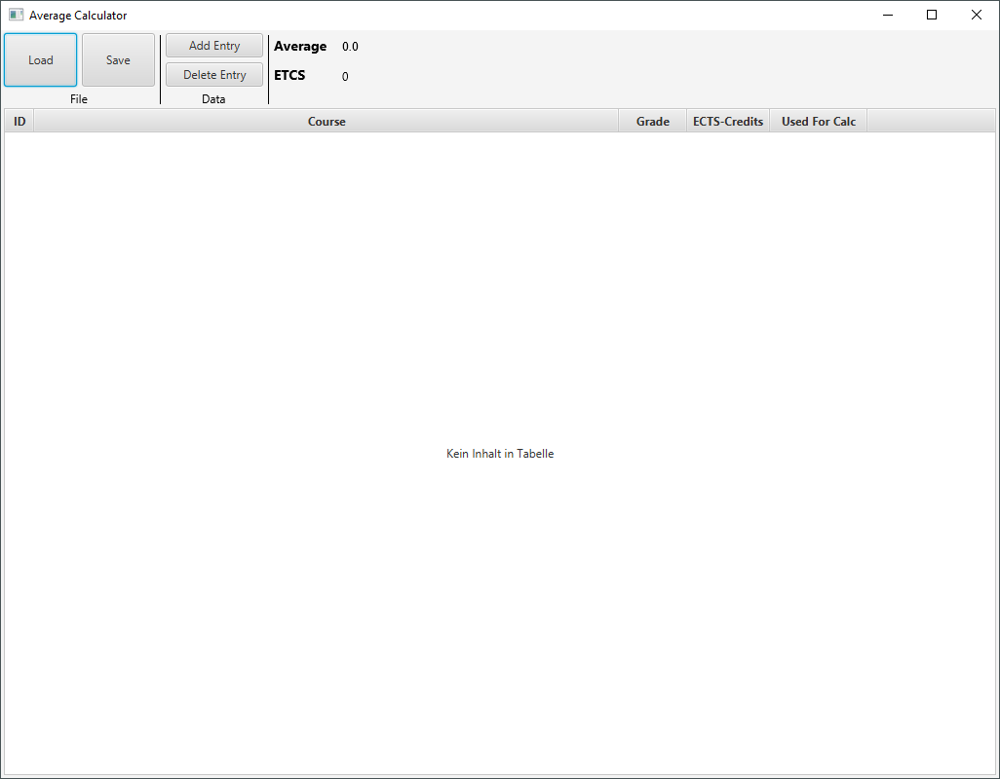

# Average Calculator
Tool to calculate your grade point average with weighting.

## How does it looks like

## How to use
Use the ***Load*** button to open files for the calculator. These files are in JSON format. 
An example file can be found here: [Sample.json](https://github.com/Sseidel248/Average_Calculator/blob/main/src/main/resources/Sample.json).
The ***Save*** button can be used to save the current data to any location on the hard disk.
With ***Add Entry*** more lines can be added and ***Delete Entry*** removes the current entry.
The column ***Used for Calc*** contains a context menu. This can be used to set all entries to checked or unchecked.

## How to calculate the average
The application uses only the grades that have a checked cell in the "Used for Calc" column.
These grades are then multiplied by the weighting and divided by the total weighting.

